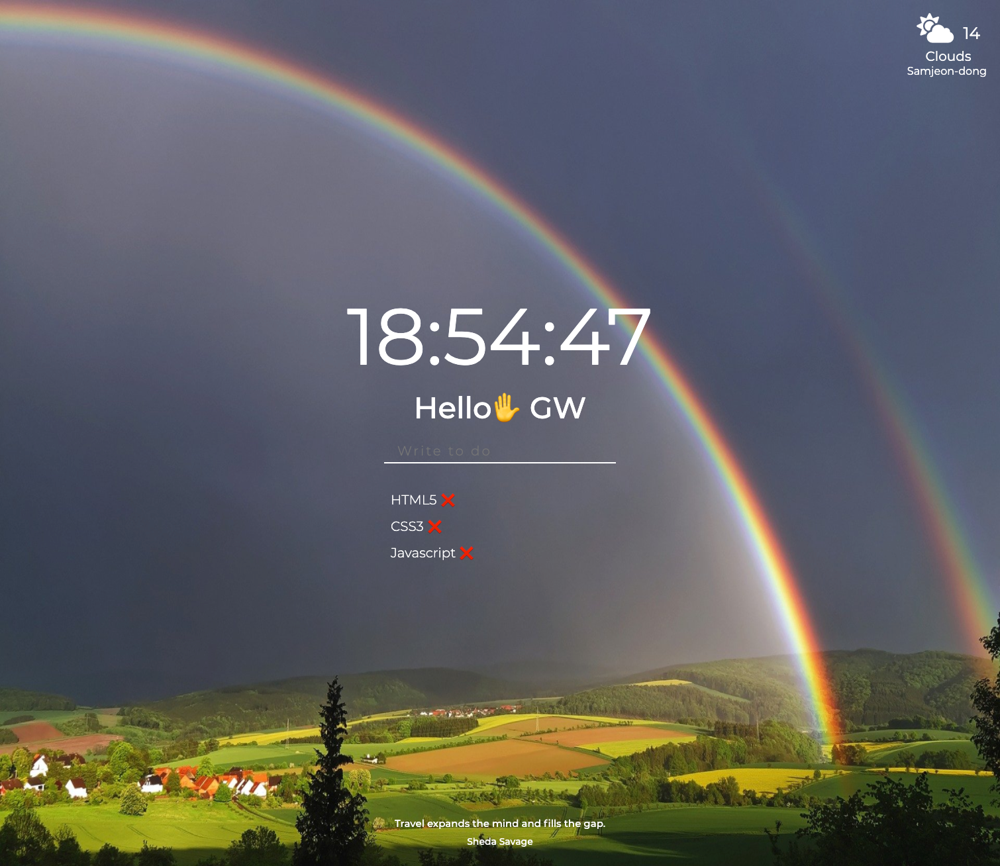
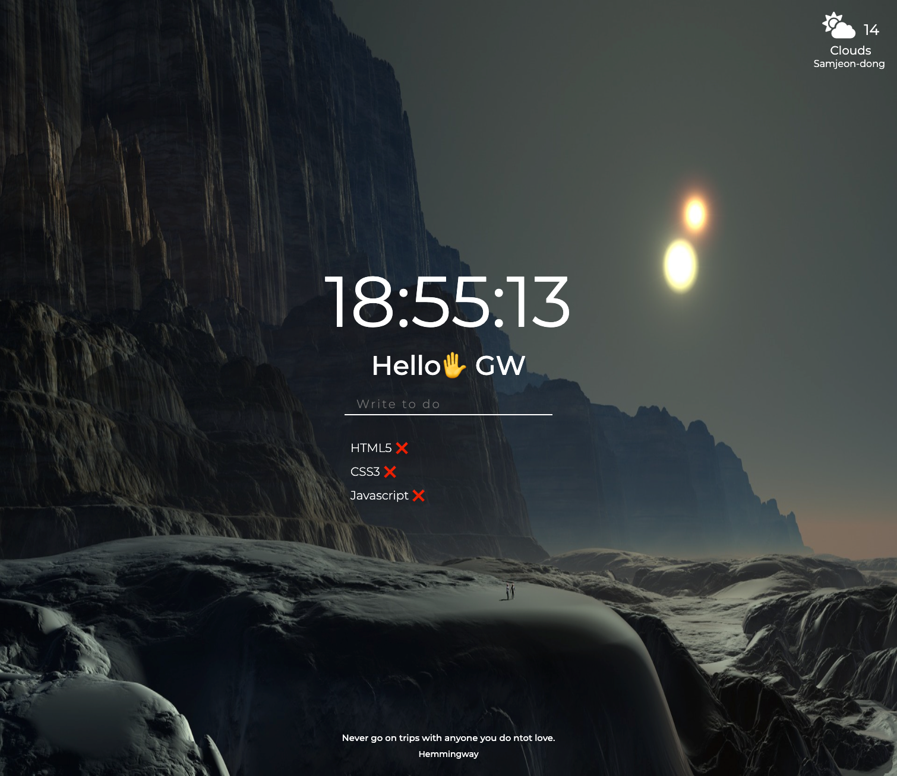

# Momentum

## 🔗 Demo

https://githubgw.github.io/js-momentum

## 🖥 Preview

## 🔥 Stack

### Front-end

  

## ✅ Packages

- [x] Javascript   
- [x] Local Storage   
- [x] AJAX    
- [x] JSON  
- [x] DOM
- [x] OpenWeather API

## 📖 Theory

- [x] Variables
- [x] Functions
- [x] Data Types
- [x] Arrays, Objects
- [x] DOM Functions
- [x] Events
- [x] if / else / for

## ⚙ Features

- [x] Real-Time Clock
- [x] To Do List
- [x] Get Geolocation
- [x] Get Weather Information
- [x] Random Background Images
- [x] Image change according to Device
